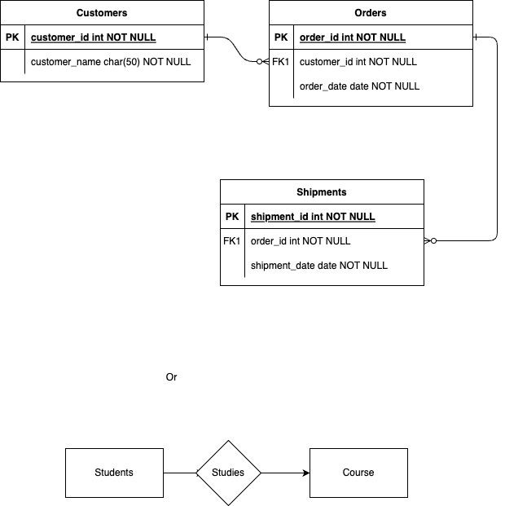

## Super key:
- It is a combination of all possible attributes which can be used to uniquely identify two tuples in a table.
- Super set of any candidate key is Super key
- It should consist minimum one candidate key, as the use case is to uniquely identify the entries.
- No. of super keys can be calculated by simple pnc.

**Example**

Q. There are n keys in a table R. i.e R(k1,k2....kn).
 - Calculate number of super keys if k1 is candidate key
 - Calculate number of super keys if k1,k2 are candidate keys.

Ans1. there are two possibilities for every key (take and not take)
Since we want at least one candidate key. We have to fix k1 everytime.
    total = 1 * 2^(n-1);
Ans2. similar to previous concept : 2*(2^(n-1)) - 2 ^ (n-2);
    Total - combinations in which k1 & k2 are common.

## Entity Relationship Model
- Used for logical representation of the database.
- Simply a model/blueprint of the database.
- Consists of basic requirements of the database.
- Fulfills the need of database designing.

Diagram : 

Types of attributes in E-R model : 
- Single vs Multivalued : 
  - Single attribute can hold only one value, example : Student's registration number in university
  - Multivalued attribute can hold multiple values, example : Mobile number
- Simple vs Composite:
  - Simple cannot be divided further into attributes, example : Student's age
  - Composite/compound can be divided further, example : name -> firstName & lastName
- Stored vs Derived:
  - Stored attribute are those properties which are taken directly as input from the user
  - Derived attribute are those properties which can be derived from other attributes, example: age can be derived from dob.
  - Derived attribute is represented by dotted eclipse.
- key vs non-key attributes:
  - key attribute is the attribute which can be used to uniquely identify the row.
  - key attribute cannot be repeated.
  - Represented with underline in E-R model.
  - non-key is normal
- Required vs Optional:
  - required fields and optional fields in entity/schema.
- Complex attribute : 
  - Composite + multivalued.