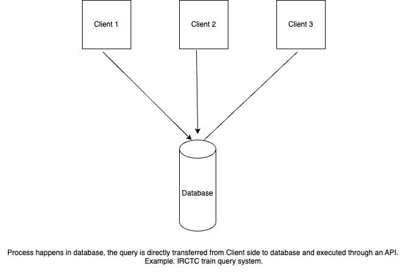
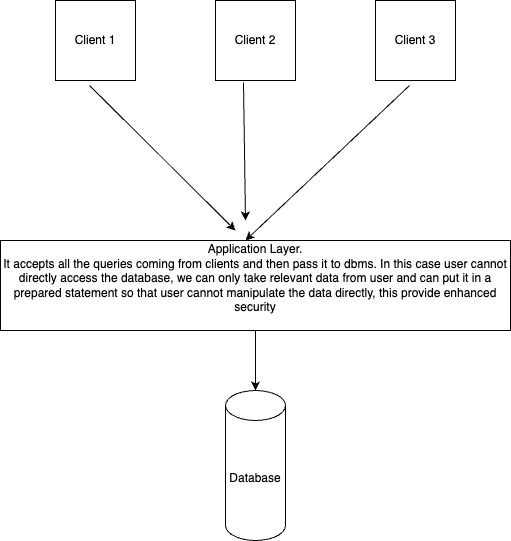

**Notes**

## Introduction :
## Types of Data : 
1. Structured Data : Data which has a fixed structure.
  -  example : University data (Student Data)
  -  IRCTC DB. (Passenger Data)
2. Un-Structured Data: Data which does not have a fixed/Predefined structure.
 - Photos
 - Videos
 - WebPages
  
**RDBMS is a tool/interface which allows users to manage their data, RDBMS deals with structured data some examples of RDBMS are my sql, oracle Db etc.**

## File Systems vs DBMS

- File systems was used before DBMS. Hence, we can say dbms is an upgrade of file systems.
- It was a user specific data base system. Just like our PC, it was personal (per user).
- The need of DBMS came because everything was moving to client-server architecture.
- In DBMS data is fetched using queries. Hence, for fetching a particular entry we don't need full files.
- DBMS enables concurrency i.e multiple users can fetch the same data at the same time. In File systems no protocol exists for concurrency.
- DBMS is more secure. It enables role based data accessibility/security.

## 2 tier & 3 tier architecture.

**2 tier**
- 2 tier arc comprises only 2 layers that is Client and Database interface.
- Generally some API runs in the client side that fetches the data from the database interface.
  1. JDBC (Java Database Connectivity).
- In 2 tier arc, accessibility is very easy, but scalability is difficult.
- Security is also less in 2 tier architecture. Since client is directly accessing the database.

**3 tier**
- It is a more scalable solution, as our bottleneck is not at database end.
- Application Layer can embed business logic hence can also be noted as business layer.
- All the web applications currently uses 3 tier architecture.

## Schema in DB

- Logical definition of data.
- Generally visualised in the form of tables in RDBMS
- example : 
  - Student table in any school.
  - Bank details of a person.
- Can be implemented through data definition languages (DDL) in SQL.