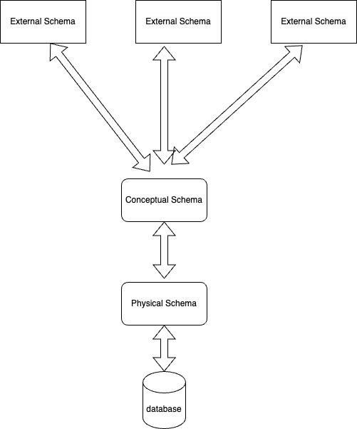

## Three Schema architecture
- Main agenda of this arc was that the user should not be able to interact with the data directly.
- It was introduced in 1970
- It has three components
  - External schema
  - Logical Schema (Conceptual schema)
  - Physical Schema (Internal schema) 
- It is a theoretical model.

**External Schema**
- It is also called the view level schema
- It represents how the data is being shown to user.
- It can be different in terms of values for different entries.
- example : Student A has 35 marks in 3 subjects, but student B has 40 marks.
- Type is same but value is different hence, it is called as view level schema.
- Student can see different roles and faculty can see different roles, similarly dean has different roles
- Example: Admin access, read only access

**Conceptual Schema**
- This represents how actually are we storing data. What is the representation of that data.
- Example : Student's data will contain roll number, Teacher will have something like salary
- ER model, relational model.
- How the tables are connected between each other is stored/mentioned in conceptual schema.
- It is like blueprint of the whole architecture.
- Database designer.

**Physical Schema**
- Where the data is actually present.
- Which disk will store the data. How fragments will perform.
- Database admin generally operates here.
- the data is being stored in file format, through abstraction the data is represented in tables in conceptual schema.

## Data Independence
- The business logic is generally hidden from the user. How the data is stored and etc etc.
- View level & conceptual schema is used to implement logical data independence.
- Changes in conceptual schema should not hamper view schema. Eg: If we add one new column, the existing data/columns 
  should work as it is. The existing behaviour should not change, we can ensure this by view level schema.
- Data can be accessed conveniently without worrying about how the data is changing.
- This type of behaviour is accessible through logical data independence.
- Physical data independence is responsible for : Any change in the physical schema should not affect the conceptual layer
- If the file system is changed, if the location of the file change or any physical change like changing the hard disk should 
  not hamper the logic by which the data is given to user. Eg: row name should not be changed, data types should not be changed
- This can be easily understand by the concept of making interface in your code. If the underlying service is changed
  functionality of the service should not change.

## Integrity Constraints
- These are the set of rules defined to maintain the accuracy, consistency, reliability of the database.
- They make sure that the data stored in the database follows the predefined rules or conditions.
- Types of Constraints : 
  - Domain Constraint:
    - It is related to the attributes.
    - For every attribute, datatype should be pre-mentioned.
    - For example: There is a age attribute stored in a table. By default, age cannot be less than 0 (or anything)
    - we can make sure by placing a check (age > 0) constraint to ensure that the value in the age column is sanitised.
  - Entity Integrity constraint: 
    - It simply states that every entity should contain a primary key and it must be **unique && not null** 
  - Referential Integrity Constraint: 
    - It is related to foreign key.
    - Parent table should contain all the data that is needed by child table.
  - Key Constraints:
    - Unique attr.
    - It states that the table (entity) should contain **at least** one unique identifier.
    - Related to candidate key.